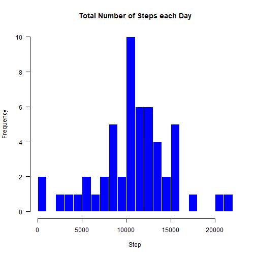
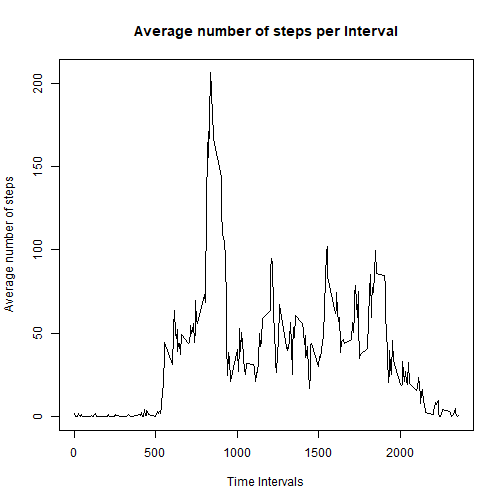
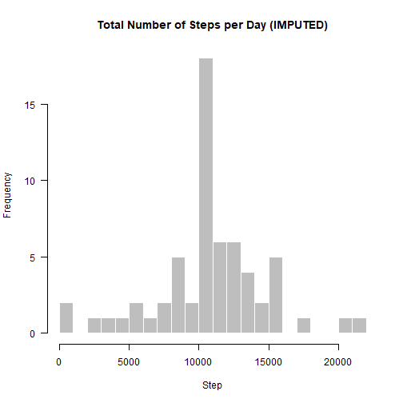
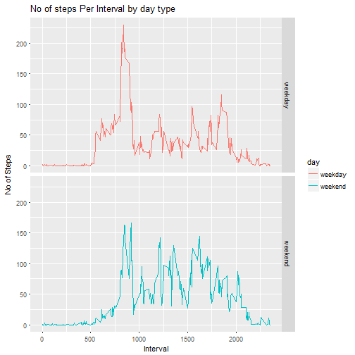

Loading necessary Libraries


```r
library(data.table)
library(ggplot2)
library(dplyr)
```

## Loading and preprocessing the data


```r
link = 'https://d396qusza40orc.cloudfront.net/repdata%2Fdata%2Factivity.zip'
if (!file.exists('./activity.zip')){
  download.file(link,'./activity.zip', mode = 'wb')
  unzip("activity.zip", exdir = getwd())
}

act_monitor <- read.csv(file = "activity.csv", 
                        as.is=TRUE)
```

## What is mean total number of steps taken per day
Total number of steps per day


```r
tot_steps_day <- aggregate(steps ~ date, data = act_monitor, sum, na.rm = TRUE)
head(tot_steps_day)
```

```
##         date steps
## 1 2012-10-02   126
## 2 2012-10-03 11352
## 3 2012-10-04 12116
## 4 2012-10-05 13294
## 5 2012-10-06 15420
## 6 2012-10-07 11015
```

Histogram of the total number of steps taken each day


```r
hist(tot_steps_day$steps, breaks = 20, 
     main = "Total Number of Steps each Day",
     col = "blue", border = "white", xlab = "Step", axes = FALSE)
axis(1)
axis(2, las = 1)
```



## Calculating and reporting the mean and median total number of steps taken per day


```r
steps_mean_day <- mean(tot_steps_day$step)
steps_median_day <- median(tot_steps_day$step)

print (paste("The mean of the total steps per day is ", steps_mean_day, "The median of the total steps per day is ", steps_median_day))
```

```
## [1] "The mean of the total steps per day is  10766.1886792453 The median of the total steps per day is  10765"
```

## What is the average daily activity pattern?
Time series plot of the 5-minute interval 


```r
average_steps_int <- aggregate(steps ~ interval, act_monitor[complete.cases(act_monitor),], mean)
```

##Plotting time series


```r
plot(average_steps_int$interval, average_steps_int$steps, type='l', col=1, main="Average number of steps per Interval", xlab="Time Intervals", ylab="Average number of steps")
```



## 5-minute interval containing the maximum number of steps


```r
max_int <- which.max(average_steps_int$steps)
print (paste("Interval with the highest avg steps is ", average_steps_int[max_int, ]$interval, " number of steps for the same interval ", average_steps_int[max_int, ]$steps))
```

```
## [1] "Interval with the highest avg steps is  835  number of steps for the same interval  206.169811320755"
```

## Imputing missing values
## Calculating and reporting total number of missing values


```r
miss_val <- act_monitor[!complete.cases(act_monitor), ]
nrow(miss_val)
```

```
## [1] 2304
```

Creating similar dataset with missing values filled in


```r
act_monitor_imput <- act_monitor
for (i in average_steps_int$interval) {
    act_monitor_imput[act_monitor_imput$interval == i & is.na(act_monitor_imput$steps),  
           ]$steps <- average_steps_int$steps[average_steps_int$interval == i]
}
```

Histogram of the total number of steps taken each day and calculate and report the mean And median total number of steps taken per day


```r
steps_average_imput <- act_monitor_imput %>% group_by(date) %>%
      summarize(total.steps = sum(steps, na.rm = T))

hist(steps_average_imput$total.steps, breaks = 20, 
     main = "Total Number of Steps per Day (IMPUTED)",
     col = "grey", border = "white", xlab = "Step", axes = FALSE)
axis(1)
axis(2, las = 1)
```



## Are there differences in activity patterns between weekdays and weekends?
Creating 'weekday' and 'weekend' factors on the dataset


```r
act_monitor_imput$day <- ifelse(as.POSIXlt(as.Date(act_monitor_imput$date))$wday%%6 == 
                                    0, "weekend", "weekday")
act_monitor_imput$day <- factor(act_monitor_imput$day, levels = c("weekday", "weekend"))

mean_spd_imput <- aggregate(steps ~ interval+day ,data = act_monitor_imput, mean)
```

Panel plot containing a time series plot


```r
g <- ggplot(mean_spd_imput, aes(interval, steps)) +
     geom_line(stat = "identity", aes(colour = day)) +
     theme_gray() +
     facet_grid(day ~ ., scales="fixed", space="fixed") +
     labs(x="Interval", y=expression("No of Steps")) +
     ggtitle("No of steps Per Interval by day type")
   
 print(g) 
```


